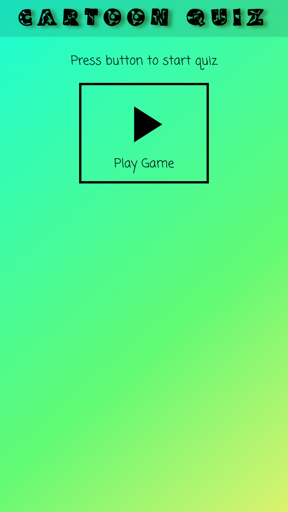
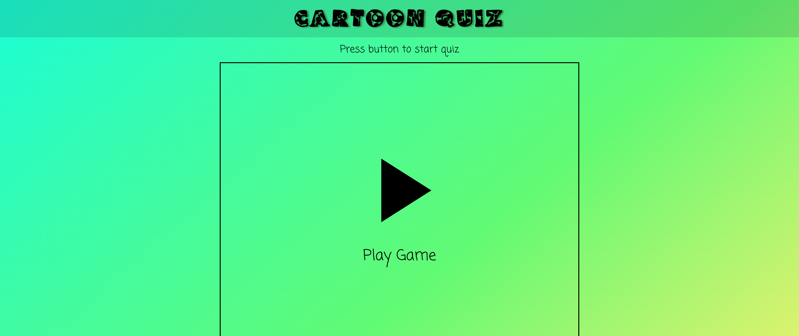
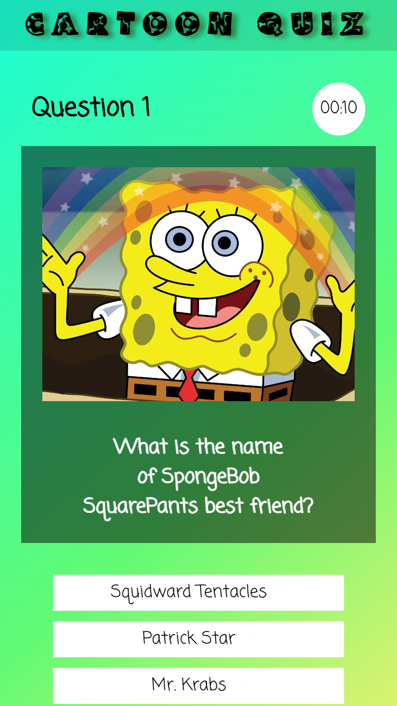
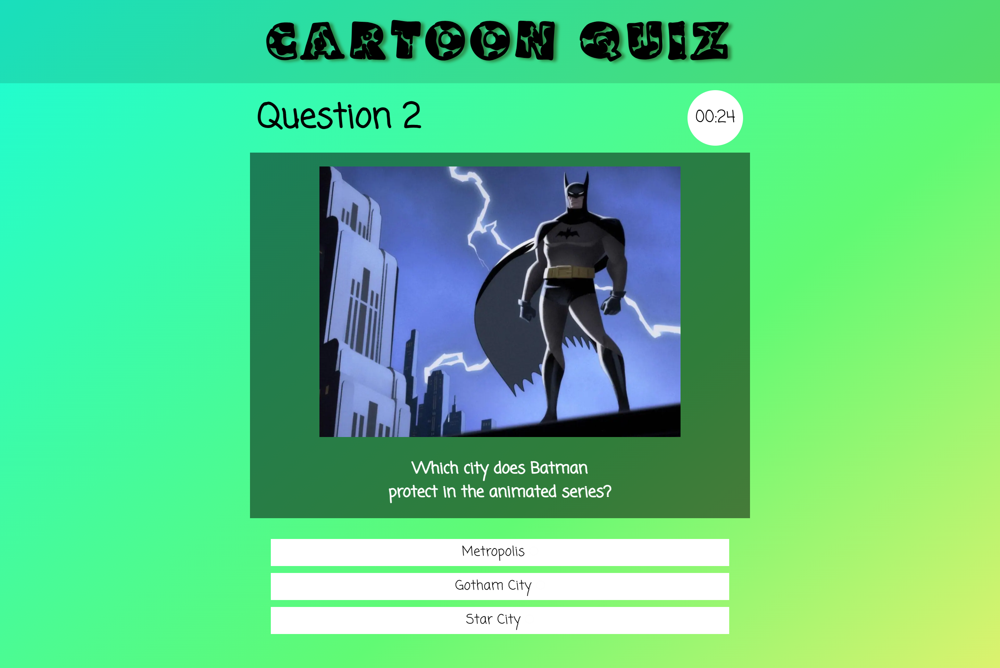
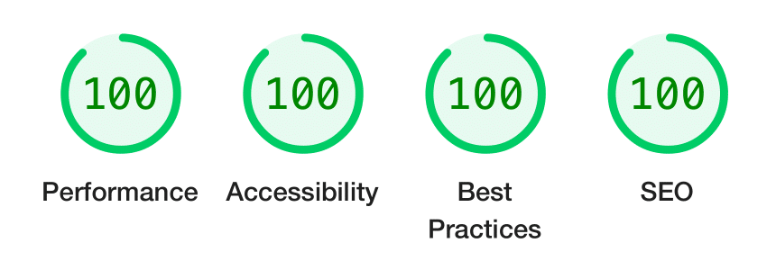

# 👶 Cartoon Quiz

**🔗 Demo: https://tgvie.github.io/MI-cartoon-quiz/**

This project is a fun cartoon-themed quiz we built together as a school group project.

- There are 20 questions in total, and each round shows 10 random ones
- Every question has 3 answer choices — but only one is right!
- If you play again, you’ll get a different set of questions
- There’s a timer that tracks how long you take, and you’ll see your score at the end

We had a great time making it and hope you enjoy playing it too! 😊

<strong>📐 Wireframes</strong>

| Start page | Question page | Result page |
| -- | -- | -- |
|  |  |  |

## 🖼️ Preview

| 📱 Phone | 💻 Desktop |
| -------- | ----------- | 
|  |  |
|  |  |

## 🛠️ Tech Stack

 

## 📋 Documentation

<strong>Lighthouse Report</strong>

| Desktop |
| ------- |
|  |

  
## ✍️ Author/s
🧑‍💻 [@matildasoderhall](https://github.com/matildasoderhall)
🧑‍💻 [@mikaelakihl](https://github.com/mikaelakihl)
🧑‍💻 [@NicoleSilfverling](https://github.com/NicoleSilfverling)
🧑‍💻 [@tgvie](https://github.com/tgvie)

